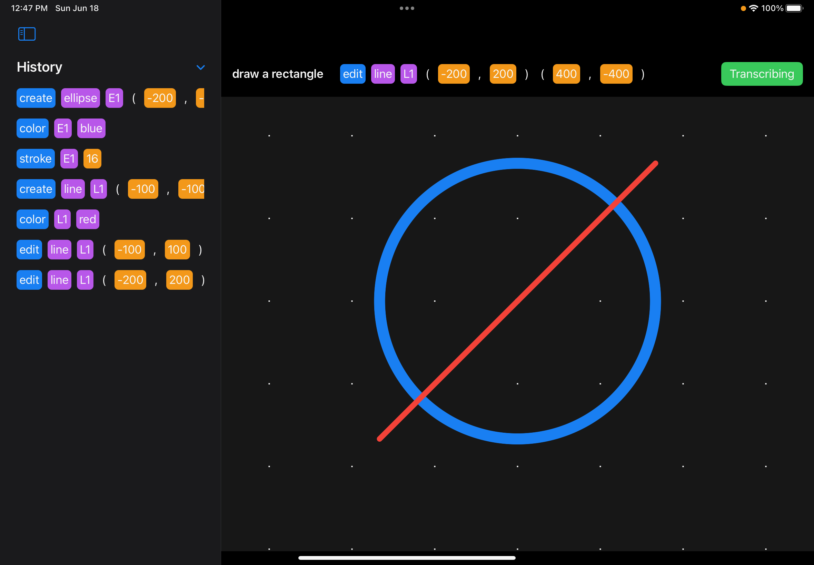
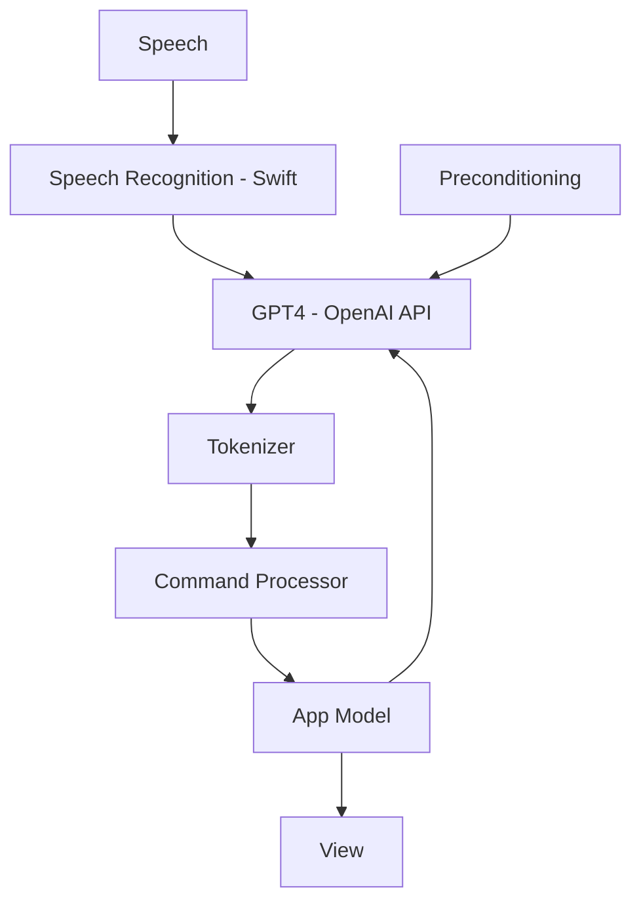

+++
title = "AccessAbility"
date = 2023-06-16
draft = false
interests = ["swiftui", "hackathon", "accessability"]
summary = "A voice controlled drawing app to demonstrate the ability to use LLMs for accessibility purposes. For CalHacks 2023."
github = "https://github.com/AdinAck/AccessAbility"
+++

## Description
**AccessAbility** provides a natural language control surface for complex apps.

Any app can register a mini-grammar with AccessAbility and allow natural language to be used to execute complex actions in the app.

## Pipeline

## Demo
[Here](https://youtu.be/-AF6FgfQURc) is a demo video.
