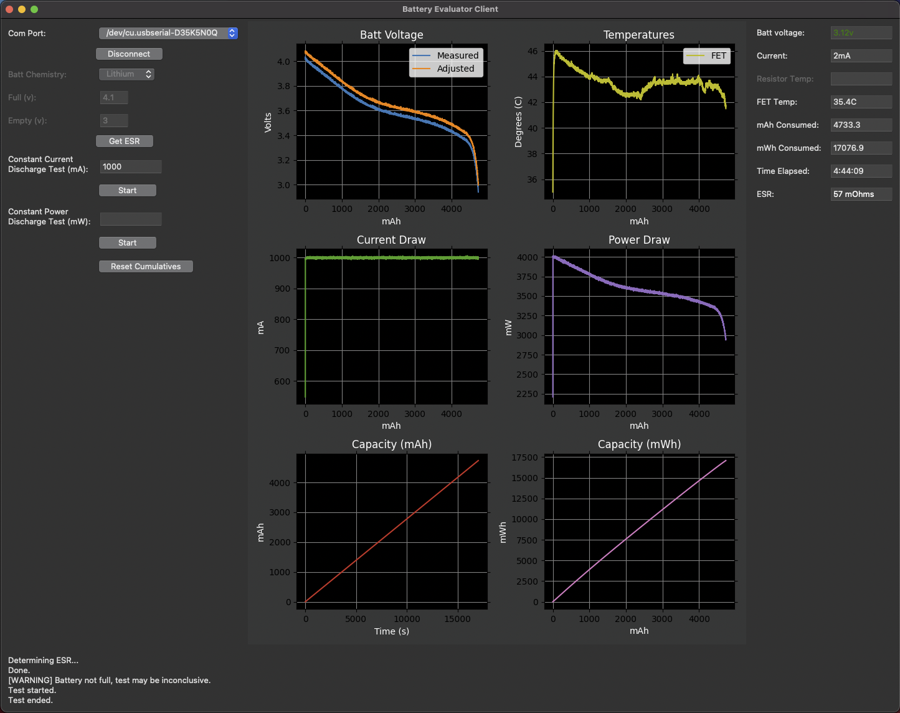
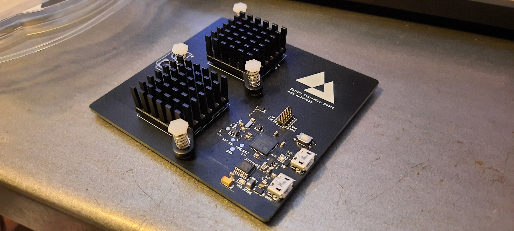

+++
title = "Battery Evaluator"
date = 2021-05-16
draft = false
interests = ["embedded", "battery-management", "tools"]
summary = "A comprehensive battery evaluator board for running simple tests and measurements, or creating a battery profile for accurately predicting charge level from voltage."
github = "https://github.com/AdinAck/Battery-Evaluator"
+++

A comprehensive battery evaluator board for running simple tests and measurements, or creating a battery profile for accurately predicting charge level from voltage.

## Electrical Characteristics
- 0-5v battery (single cell)
- 0-1000mA programable constant current draw
- Do not reverse polarity of battery, the board will die
- While you *can* plug in a battery before USB is plugged in... you shouldn't

## Software Features
- Graph the measured and predicted battery voltage with respect to mAh consumed
- Measure ESR
- Measure mWh consumed
- Monitor temperature of FETs and resistors

## To Be Implemented
- More battery chemistries
- [Op-Amp oscillation fix](https://github.com/AdinAck/Battery-Evaluator/issues/1)
- Combine multiple constant current tests to make the ultimate battery profile
- Generate voltage, current -> percent charge function
