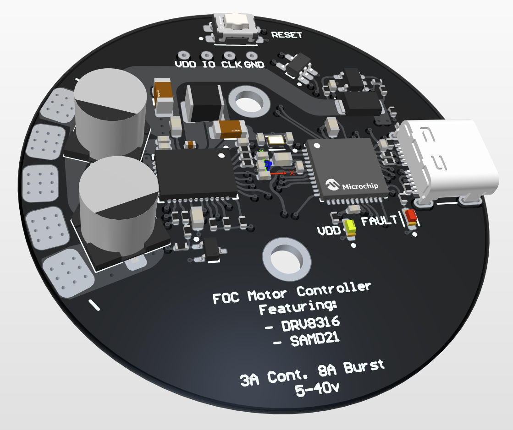
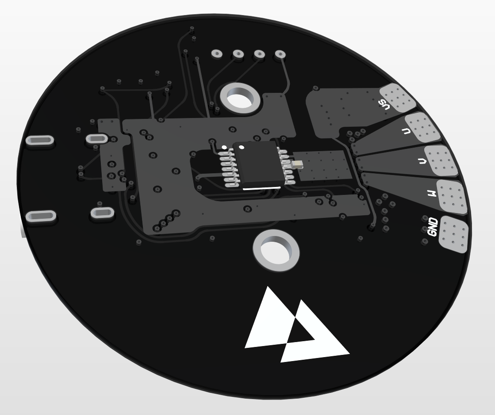
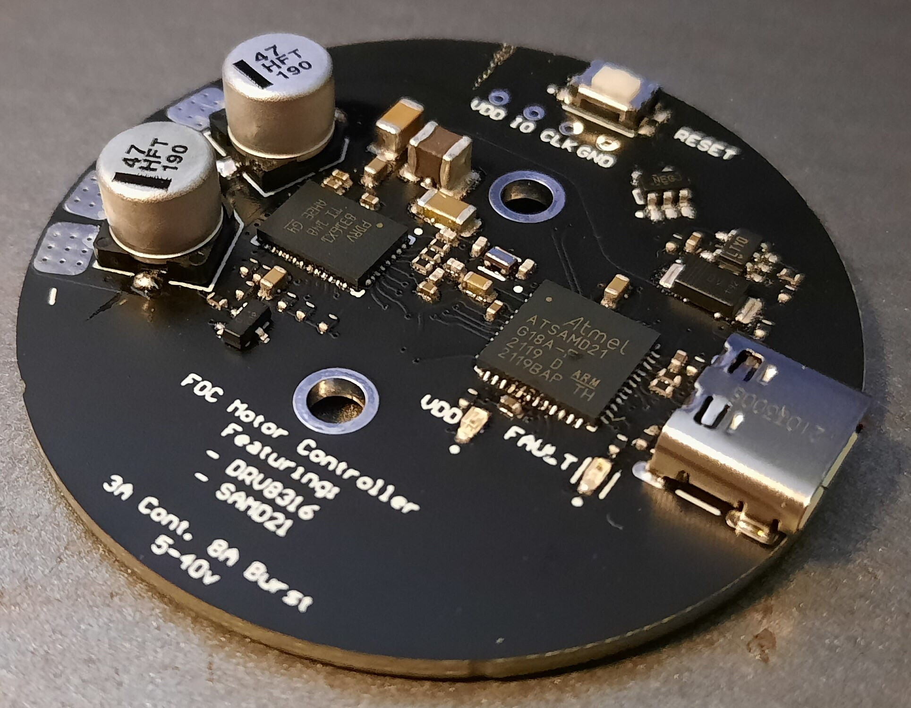

+++
title = "Motor Controller"
date = 2021-09-07
draft = false
interests = ["embedded", "motor-control", "power"]
summary = "An FOC motor controller featuring the DRV8316 and SAMD21 designed to mount directly to BLDC motors."
github = "https://github.com/AdinAck/Motor-Controller"
+++

An FOC motor controller featuring the DRV8316 and SAMD21 designed to mount directly to BLDC motors.

Top Side | Bottom Side
:-------:|:-----------:
  |  

