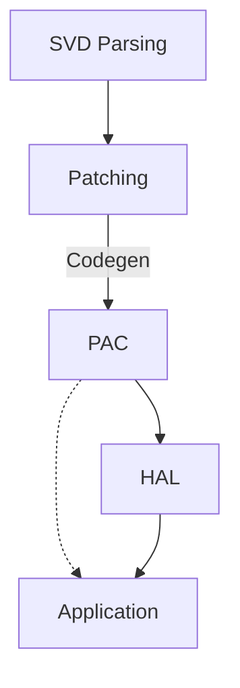

+++
title = "CSE 291 Project Propositum"
date = 2024-10-15
draft = false
+++

Embedded system firmware has been written in C for decades, but recently a movement to use Rust instead has surfaced.

The Embedded Rust project is still in its infancy, and demands careful attention and consideration for its emerging design.

You probably know this already, and are aware of the benefits of Rust in any system, for this propositum I will outline the
scope of the project, what has been done, what is to be done, the future, motivation, etc.

## Table of Contents
- [Goal](#goal)
- [Ecosystem](#ecosystem)
- [Motivation](#motivation)
  - [C](#c)
  - [Rust](#rust)
  - [Rust (HAL)](#rust-hal)
- [Observation](#observation)
- [Breakdown](#breakdown)

## Goal

My work involves the fortification of the interfaces exposed by the entire Embedded Rust stack. Maximization of safety, ergonomics, and
performance is paramount.

The scope of this project will be some subset of this work, which will be elaborated later.

Prior work: [Better HALs: First Look](/blog/better-hals-first-look)

## Ecosystem

It is important to understand the architecture of the Embedded Rust ecosystem, it is as follows:



Every layer represents an independent Rust crate or group of crates.

1. SVD[^1] files are parsed and reconstituted as YAMLs.
1. Manual patches are applied (because vendors take pride in their rate of error).
1. These patches are used to generate representative structures for register blocks/fields/types which
is called the PAC[^2].
1. The HALs define higher level structures which use the PAC internally.
1. The application uses the HAL structures and the PAC for any holes in the HAL

My work spans across this entire domain.

## Motivation

As a *safety-ciritcal* aware system designer, I indulge myself in any and all methods of maximizing **guarantees** of any kind.

Whether it be verification that some component of the system behaves in some way no matter what, or that the fundamental ideas
behind some design pattern will always scale to whatever application may use them.

Rust as a language (if properly coerced) can provide us with incredible guarantees about our system, let's look at a common example.

"I want EXTI to fire on the rising edge of pin PB3."

### C

Manufacturers provide direct and fragile abstractions for us to use.

To achieve our goal looks like this:

```c
void main() {
    // enable GPIOB clock
    RCC->AHB2ENR |= RCC_AHBENR_GPIOBEN;

    // configure PB3 as input
    GPIOB->MODER &= ~GPIO_MODER_MODER3_Msk;
    GPIOB->MODER |= (0x00 << GPIO_MODER_MODER3_Pos);

    // disable PB3 pull-up/down
    GPIOB->PUPDR &= ~GPIO_PUPDR_PUPDR3_Msk;

    // enable SYSCFG clock
    RCC->APB2ENR |= RCC_APB2ENR_SYSCFGEN;

    // for lane 3, select port B
    SYSCFG->EXTICR[0] &= SYSCFG_EXTICR1_EXTI3_Msk;
    SYSCFG->EXTICR[0] |= SYSCFG_EXTICR1_EXTI3_PB;

    // unmask lane 3
    EXTI->IMR1 |= EXTI_IMR1_IM3;

    // configure lane 3 for rising edge triggering
    EXTI->RTSR1 |=  EXTI_RTSR1_RT3;
    EXTI->FTSR1 &= ~EXTI_FTSR1_FT3;

    // not even going to show the IRQ response code
}
```

I want to make it extremely clear that this code **terrifies** me, here's why!

1. In order to configure the EXTI peripheral, we interacted with... **3** other peripherals? I wonder
who else is interacting with those peripherals...
1. I tricked you, that code is *not* correct and catastrophically so, could you tell?
The compiler sure couldn't!
1. Is this code context agnostic? In other words, could changing code *outside* of this function
render it inoperable?

The answers to all of these questions are:

1. Who knows
1. No you couldn't
1. With ease

All of which result in **silent incorrectness**.

> The correction to make the code work as expected is:
> ```diff
> -SYSCFG->EXTICR[0] &=  SYSCFG_EXTICR1_EXTI3_Msk;
> +SYSCFG->EXTICR[0] &= ~SYSCFG_EXTICR1_EXTI3_Msk;
> ```

We are here to talk about Rust though, so let's quickly stop writing any C and look at how Rust would handle this.

### Rust

Rather than providing raw structs to memory regions, PACs expose types that correspond to register blocks and fields:

```rust
#[entry]
fn main() {
    // acquire all peripherals
    let p = Peripherals::take();

    // enable GPIOB clock
    p.RCC.ahb2enr().write(|w| {
        w.gpioben().enabled();
    });

    // configure PB3 as input
    p.GPIOB.moder().write(|w| {
        w.moder3().input();
    });

    // disable PB3 pull-up/down
    p.GPIOB.pupdr().write(|w| {
        w.pupdr3().floating();
    });

    // enable SYSCFG clock
    p.RCC.apb2enr().write(|w| {
        w.syscfgen().enabled();
    });

    // for lane 3, select port B
    p.SYSCFG.exticr1().write(|w| {
        w.exti3().portb();
    });

    // unmask lane 3
    p.EXTI.imr1().write(|w| {
        w.im3().unmasked();
    });

    // configure lane 3 for rising edge triggering
    ctx.device.EXTI.rtsr1().write(|w| w.rt3().enabled());
    ctx.device.EXTI.ftsr1().write(|w| w.ft3().disabled());

    // still not going to show the IRQ response code
}
```

Are the comments even necessary any more?

The mistake made in the C version is not even possible here.

Let's ask the same questions again:

**Q:** In order to configure the EXTI peripheral, we interacted with... **3** other peripherals? I wonder
who else is interacting with those peripherals...

**A:** This remains unresolved since the `write` method does not require an
exclusive reference to the register block.

**Q:** Is *this* code correct?

**A:** While it is immune to simple arithmetic errors, the validity of register values with relation
to *other* register values is not guaranteed. Some peripheral configurations are not valid across
all combinations of register values.

**Q:** Is this code context agnostic? In other words, could changing code *outside* of this function
render it inoperable?

**A:** Since the **type** of each peripheral is not dependent on our action, external code could
put the peripherals into states we did not expect and interfere with the behavior of our code.

---

*Ahah... types ;)*

This is where the HAL comes in. We can create type-states which represent peripheral configurations.

### Rust (HAL)

Let's do this once more, using a HAL:

```rust
fn main() {
    let p = Peripherals::take();

    let rcc: RccParts = p.RCC.split();

    let gpiob: GpioBParts = p.GPIOB.split();
    let pb3: PB3<Input<Floating>> = gpiob.pb3.freeze();

    let syscfg_en: Rcc<SysCfg, Enabled> = rcc.syscfg_en.freeze();
    let syscfg: SysCfgParts = p.SYSCFG.split(syscfg_en);
    let exti3_syscfg: SysCfg<EXTI3, PB> = syscfg.exti3.freeze();

    let exti: ExtiParts = p.EXTI.split();
    let lane3: Exti<L3, Unmasked<PB3<Input<Floating>>, Rising>> = exti.gpio3.freeze(exti_syscfg, pb3);
}
```

**Q:** In order to configure the EXTI peripheral, we interacted with... **3** other peripherals? I wonder
who else is interacting with those peripherals...

**A:** In order to do so they would need ownership of the constrained peripheral types which would require
safe deconstruction. Any other usage would require .

**Q:** Is *this* code correct?

**A:** The type-states guarantee correctness. (Details of how this is done in [Better HALs: First Look](/blog/better-hals-first-look))

**Q:** Is this code context agnostic? In other words, could changing code *outside* of this function
render it inoperable?

**A:** Since the **type** of each peripheral *is* dependent on our action, behavior is only possible
on types which define it as such. All necessary hardware invariances must be established before desired
use.

---

Levaraging Rust's ownership model, many of these steps had "prerequisites".

For example, it doesn't make sense to enable an EXTI lane if the corresponding port selection hasn't been done with SYSCFG.
And you can't even do that until you *enable* SYSCFG!

Since the state of peripherals is represented with types and the capability of methods is expressed by their
type signatures, the ability to produce logical errors is approaching zero.

The code you just read is a glimpse into what can be. As of now, HALs are not quite at this point.

Some things are strictly represented by type-states, others (like EXTI) are not.

The goal is for all HAL interfaces to be consistent, comprehensive, and .

## Observation

EXTI "observes" GPIO via hardware. We represented this by *moving* the pin into the EXTI lane for usage.

But... now we can't use the pin in software as it has been moved. Nothing about the hardware
dictates that software can no longer control the pin while EXTI observes it.

Furthermore, *other* peripherals may want to observe the pin as well, like the ADC or comparators.

The current design fails to express this.

I propose the addition of "peripheral observation" where peripherals can be encapsulated by an
observation fascilitating type which dispatches "observation tokens" representing a
hardware subscription to the peripheral.

Details of this are discussed in [this draft PR](https://github.com/stm32-rs/stm32g4xx-hal/pull/138).

And a sketch of the design is in [this gist](https://gist.github.com/AdinAck/c5713baf8b92d7075e10a9e03591569a).

## Breakdown

The breakdown of "projects" involved in this work are:

- Modifying [svd2rust](https://github.com/rust-embedded/svd2rust) to generate unique types for registers and fields.
- Solidifying procedure and design philosophy for type-state oriented HAL interfaces (proto-hal).
  - Updating current HAL implementations to reflect this.
  - Creating procedural macros to fascilitate this.
- Integrating "observation" design pattern.

[^1]: SVD files are provided by the manufacturer and outline the register map for the entire device.
[^2]: PAC: **P**eripheral **A**ccess **C**rate
