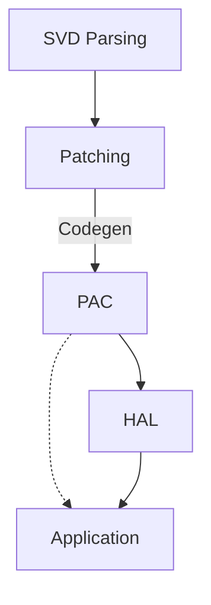

+++
title = "CSE 291 Project Propositum"
date = 2024-10-15
draft = false
+++


> A video of my onewheel shutting off at nearly 30 mph due to poorly designed firmware.

Millions of people rely on **systems** to keep them safe every day.

When these systems fail, people get hurt. It the responsibility of systems engineers to do everything within their power
to eliminate modes of failure.

So what steps can be taken to ensure catastrophic failures do not occur?

It is common knowledge that Rust is used to ensure *memory* safety and general correctness via the type system.

Our project proposes a system for extending Rust's safety guarantees to HALs[^4].

Microcontroller peripherals can be extraordinarily complex to use, and can sink valuable developer time.

Our system would not only enforce **hardware invariances**, but the resulting interface would be readable, robust, and consistent
across vendors.

## Table of Contents
- [Ecosystem](#ecosystem)
- [Motivation](#motivation)
  - [C](#c)
  - [Rust](#rust)
  - [Rust (HAL)](#rust-hal)
- [Observation](#observation)
- [Breakdown](#breakdown)

## Ecosystem

It is important to understand the architecture of the Embedded Rust ecosystem, it is as follows:



Every layer represents an independent Rust crate or group of crates.

1. SVD[^1] files are parsed and reconstituted as YAMLs.
1. Manual patches are applied (because vendors take pride in their rate of error).
1. These patches are used to generate representative structures for register blocks/fields/types which
is called the PAC[^2].
1. The HALs define higher level structures which use the PAC internally.
1. The application uses the HAL structures and the PAC for any holes in the HAL

## Example

Let's endeavor to complete a simple task on a microcontroller with existing methods and compare to the proposed interface.

"I want EXTI[^3] to fire on the rising edge of pin PB3."

### C

Manufacturers provide direct and fragile abstractions for use.

Implementing the task looks like this:

```c
void main() {
    // enable GPIOB clock
    RCC->AHB2ENR |= RCC_AHBENR_GPIOBEN;

    // configure PB3 as input
    GPIOB->MODER &= ~GPIO_MODER_MODER3_Msk;
    GPIOB->MODER |= (0x00 << GPIO_MODER_MODER3_Pos);

    // disable PB3 pull-up/down
    GPIOB->PUPDR &= ~GPIO_PUPDR_PUPDR3_Msk;

    // enable SYSCFG clock
    RCC->APB2ENR |= RCC_APB2ENR_SYSCFGEN;

    // for lane 3, select port B
    SYSCFG->EXTICR[0] &= SYSCFG_EXTICR1_EXTI3_Msk;
    SYSCFG->EXTICR[0] |= SYSCFG_EXTICR1_EXTI3_PB;

    // unmask lane 3
    EXTI->IMR1 |= EXTI_IMR1_IM3;

    // configure lane 3 for rising edge triggering
    EXTI->RTSR1 |=  EXTI_RTSR1_RT3;
    EXTI->FTSR1 &= ~EXTI_FTSR1_FT3;

    // not even going to show the IRQ response code
}
```

This code is extremely fragile for the following reasons:

1. Multiple peripherals are involved in an ambiguous manner.
1. This code is not actually correct. Not only is this not obvious to a reader, but the compiler is
not powerful enough to determine as such to warn the reader.
1. The behavior of this code is not guaranteed across all contexts.

The listed failures of this code are categorized as **silent incorrectness**.

> The correction to make the code work as expected is:
> ```diff
> -SYSCFG->EXTICR[0] &=  SYSCFG_EXTICR1_EXTI3_Msk;
> +SYSCFG->EXTICR[0] &= ~SYSCFG_EXTICR1_EXTI3_Msk;
> ```

### Rust

Rather than providing raw structs to memory regions, PACs expose types that correspond to register blocks and fields:

```rust
#[entry]
fn main() {
    // acquire all peripherals
    let p = Peripherals::take();

    // enable GPIOB clock
    p.RCC.ahb2enr().write(|w| {
        w.gpioben().enabled();
    });

    // configure PB3 as input
    p.GPIOB.moder().write(|w| {
        w.moder3().input();
    });

    // disable PB3 pull-up/down
    p.GPIOB.pupdr().write(|w| {
        w.pupdr3().floating();
    });

    // enable SYSCFG clock
    p.RCC.apb2enr().write(|w| {
        w.syscfgen().enabled();
    });

    // for lane 3, select port B
    p.SYSCFG.exticr1().write(|w| {
        w.exti3().portb();
    });

    // unmask lane 3
    p.EXTI.imr1().write(|w| {
        w.im3().unmasked();
    });

    // configure lane 3 for rising edge triggering
    ctx.device.EXTI.rtsr1().write(|w| w.rt3().enabled());
    ctx.device.EXTI.ftsr1().write(|w| w.ft3().disabled());

    // still not going to show the IRQ response code
}
```

The mistake made in the previous C code is not expressible as valid Rust code.

The following failures still remain:

1. Ambiguous resource usage.
1. Correctness is not guaranteed.
1. Behavior is not context agnostic.

### Rust (HAL)

Fully leveraging the type system, peripheral states and relations are comprehensively
represented:

```rust
fn main() {
    let p = Peripherals::take();

    let rcc: RccParts = p.RCC.split();

    let gpiob: GpioBParts = p.GPIOB.split();
    let pb3: PB3<Input<Floating>> = gpiob.pb3.freeze();

    let syscfg_en: Rcc<SysCfg, Enabled> = rcc.syscfg_en.freeze();
    let syscfg: SysCfgParts = p.SYSCFG.split(syscfg_en);
    let exti3_syscfg: SysCfg<EXTI3, PB> = syscfg.exti3.freeze();

    let exti: ExtiParts = p.EXTI.split();
    let lane3: Exti<L3, Unmasked<PB3<Input<Floating>>, Rising>> = exti.gpio3.freeze(exti_syscfg, pb3);
}
```

1. ~~Ambiguous resource usage.~~ Resources are moved into structures to indicate usage.
1. ~~Correctness is not guaranteed.~~ Invalid peripheral states do not exist and usage of
peripherals is restricted to valid operations given the statically determined state.
1. ~~Behavior is not context agnostic.~~ Since the types encode the hardware state,
plopping this code into an environment where the peripherals are referenced externally
or not in the expected state would require  and safe transformation
respectively.

---

**The correctness of the peripheral usage is now guaranteed by Rust's type system.**

## Observation

EXTI "observes" GPIO via hardware. This was represented by *moving* the pin into the EXTI lane for usage.

Unfortunately, the pin can no longer be used by software as it has been moved. Nothing about the hardware
dictates that software can no longer control the pin while EXTI observes it.

Furthermore, *other* peripherals may want to observe the pin as well, like the ADC or comparators.

The current design fails to express this.

We propose the addition of "peripheral observation" where peripherals can be encapsulated by an
observation fascilitating type which dispatches "observation tokens" representing a
hardware subscription to the peripheral.

Details of this are discussed in [this draft PR](https://github.com/stm32-rs/stm32g4xx-hal/pull/138).

And a sketch of the design is in [this gist](https://gist.github.com/AdinAck/c5713baf8b92d7075e10a9e03591569a).

## Breakdown

The breakdown of "projects" involved in this work are:

- Modifying [svd2rust](https://github.com/rust-embedded/svd2rust) to generate unique types for registers and fields.
- Solidifying procedure and design philosophy for type-state oriented HAL interfaces (proto-hal).
  - Updating current HAL implementations to reflect this.
  - Creating procedural macros to fascilitate this.
- Integrating "observation" design pattern.

[^1]: SVD files are provided by the manufacturer and outline the register map for the entire device.
[^2]: PAC: **P**eripheral **A**ccess **C**rate.
[^3]: EXTI is a peripheral in STM32 microcontrollers that fascilitates external interrupt registration. For example,
pin voltage edges can trigger interrupts.
[^4]: HAL: **H**ardware **A**bstraction **L**ayer.
